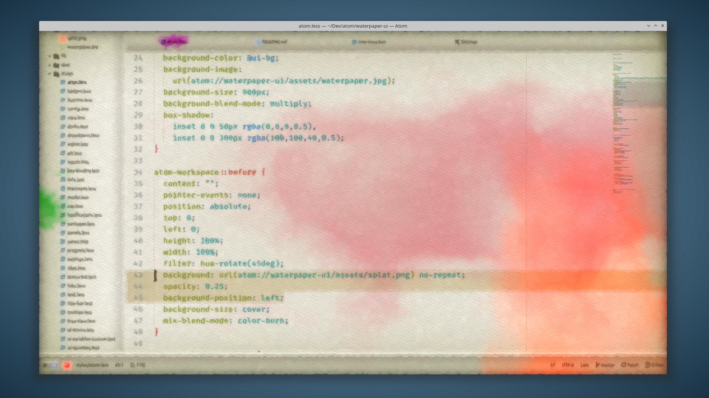
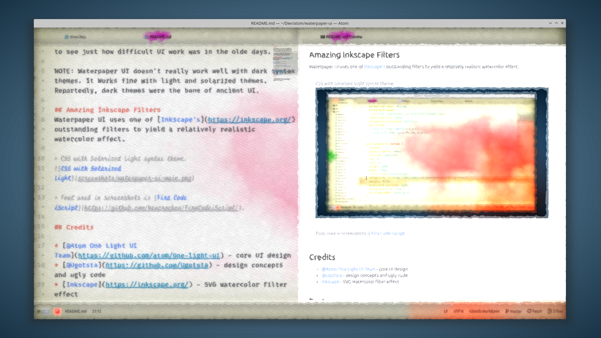

# Waterpaper UI

A digital replica of an early user interface design, from back in the olde times when UI was done in watercolor. Being quite aged now, it may be a bit tough to read. But it helps to see just how difficult UI work was in the olde days.

NOTE: Waterpaper UI doesn't really work well with dark syntax themes. It Works fine with light and solarized themes. Reportedly, dark themes were the bane of ancient UI.

## Amazing Inkscape Filters
Waterpaper UI uses one of [Inkscape's](https://inkscape.org/) outstanding filters to yield a relatively realistic watercolor effect.

> CSS with Solarized Light syntax theme.

> Markdown preview with Atom One Light syntax theme. Makdown previews are a special sort of fun in watercolor.

> Font used in screenshots is [Fira Code iScript](https://github.com/kencrocken/FiraCodeiScript/).

## Credits

* [@Atom One Light UI Team](https://github.com/atom/one-light-ui) - core UI design
* [@Ugotsta](https://github.com/Ugotsta) - design concepts and ugly code
* [Inkscape](https://inkscape.org/) - SVG watercolor filter effect

## Features

* Shows how unfeasible it is to code using watercolor.
* CPU-intensive styling accurately emulates sluggish interfaces of olden times.
